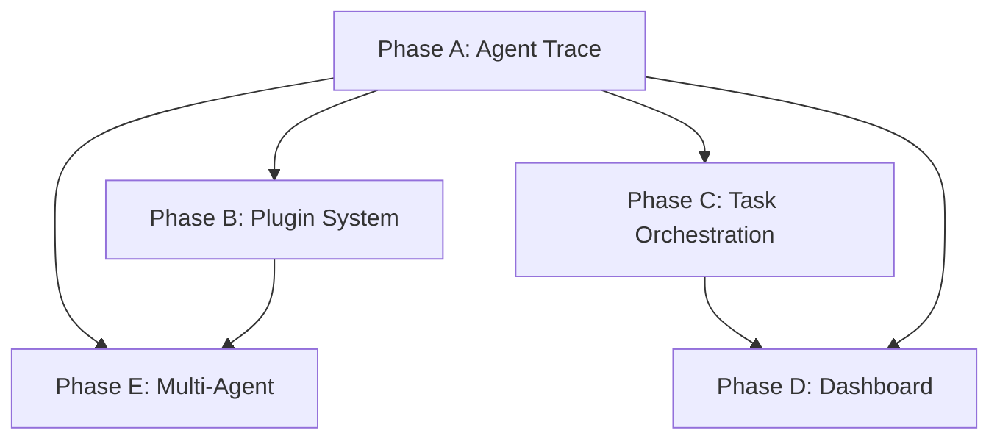

# Tier 1 Features — Implementation Plan

Elevate Hada from an AI chat app into a showcase agentic orchestration platform by implementing 5 high-impact features across the existing architecture.

---

## Implementation Order

| Phase | Feature | Effort | Dependencies | Status |
|-------|---------|--------|--------------|--------|
| **Phase A** | Agent Trace / Reasoning Timeline | 2-3 days | None | ✅ Done |
| **Phase B** | Tool Plugin System | 1-2 days | Phase A | ✅ Done |
| **Phase C** | Multi-Step Task Orchestration | 2-3 days | Phase A | ✅ Done |
| **Phase D** | Live Dashboard / Control Plane | 3-4 days | Phase A + C | ✅ Implemented |
| **Phase E** | Multi-Agent Delegation | 2-3 days | Phase A + B | ✅ Done |

## Current Status Snapshot

All five phases in this document have now been implemented in the codebase.

Delivered scope:
- inline chat traces with tool/reasoning cards
- tool registry plus `/api/tools` manifest introspection
- multi-step planning with task-plan progress in chat
- dashboard/control plane backed by `agent_runs`
- nested specialist delegation with grouped traces

Current follow-up notes:
- dashboard task `Run now` intentionally returns `501` until immediate execution is wired through the scheduler path
- task editing is available at the API layer; the dashboard UI currently focuses on toggle/delete/run-now
- `agent_runs` currently stores run/tool telemetry, but not token-usage accounting

> **Feature 1 (Agent Trace) is the foundation** — it introduces the event enrichment and UI components that every subsequent feature builds upon.



---

## Feature 1: Agent Trace / Reasoning Timeline (✅ COMPLETED)

Surfaces the agent's internal execution (tool calls, results, latency, errors) as collapsible trace cards inline in the chat UI.

### Changes Made

#### [MODIFY] `src/lib/types/database.ts`
- Extended `AgentEvent` union with richer event payloads:
  - `tool_call` → added `callId: string`
  - `tool_result` → added `callId: string`, `durationMs: number`, `truncated: boolean`
  - New: `{ type: "thinking"; content: string }`

#### [MODIFY] `src/lib/chat/agent-loop.ts`
- Track `Date.now()` before/after each `runTool()` call → yield `durationMs`
- Generate stable `callId` per tool invocation
- Yield `thinking` events when reasoning content is detected

#### [MODIFY] `src/app/api/chat/route.ts`
- Pass through new event fields (`callId`, `durationMs`, `thinking`) in SSE `data:` payloads

#### [NEW] `src/components/chat/agent-trace.tsx`
- `<AgentTraceCard>` — collapsible card showing tool name + icon, arguments, latency badge
- `<AgentTraceTimeline>` — vertical timeline grouping trace cards
- `<ThinkingCard>` — expandable reasoning block

#### [MODIFY] `src/app/chat/page.tsx`
- Accumulate events into `traceEvents[]` and `thinkingEvents[]` arrays on streaming message
- Render `<AgentTraceTimeline>` inline within assistant messages

---

## Feature 2: Tool Plugin System (✅ COMPLETED)

Refactored from a hardcoded tool list to a pluggable registry with manifests, categories, and introspection.

### Changes Made

#### [NEW] `src/lib/chat/tools/tool-registry.ts`
- `ToolManifest` interface: name, displayName, description, category, parameters, requiresIntegration, riskLevel
- `ToolRegistry` class with `register()`, `getAvailable()`, `getManifests()`, `getByCategory()`
- Filters tools by connected integrations at runtime

#### [MODIFY] All existing tools (`save-memory.ts`, `recall-memory.ts`, `schedule-task.ts`, `web-search.ts`, `web-fetch.ts`, `google-calendar.ts`)
- Each tool exports a `manifest: ToolManifest` alongside the factory function

#### [MODIFY] `src/lib/chat/tools/index.ts`
- `createTools()` uses registry internally, backward-compatible return of `AgentTool[]`

#### [NEW] `src/app/api/tools/route.ts`
- `GET /api/tools` — returns registered tool manifests for UI/dashboard consumption

---

## Feature 3: Multi-Step Task Orchestration (✅ COMPLETED)

> *Plan, execute, track.*

Add a planning layer where the agent can decompose complex requests into a sequence of subtasks, execute them in order with progress tracking, and show the user a live plan view.

### Existing Infrastructure

The types are already defined in `database.ts`:
```typescript
interface TaskStep {
  id: string;
  title: string;
  description: string;
  status: "pending" | "running" | "done" | "failed";
  toolsNeeded?: string[];
}

interface TaskPlan {
  id: string;
  steps: TaskStep[];
}
```

The `AgentEvent` union already includes (but nothing yields them yet):
```typescript
| { type: "plan_created"; plan: TaskPlan }
| { type: "step_started"; stepId: string; planId: string }
| { type: "step_completed"; stepId: string; planId: string; result: string }
```

### Implementation

#### Step C1: Plan Task Tool

##### [NEW] `src/lib/chat/tools/plan-task.ts`

A new tool that lets the agent create a structured execution plan. The agent calls this tool when it recognizes a multi-step request.

```typescript
export const manifest: ToolManifest = {
  name: "plan_task",
  displayName: "Plan Task",
  description: "Decompose a complex request into ordered subtasks with tool assignments",
  category: "system",
  riskLevel: "low",
  parameters: {
    type: "object",
    properties: {
      goal: { type: "string", description: "The overall goal to accomplish" },
      steps: {
        type: "array",
        items: {
          type: "object",
          properties: {
            title: { type: "string" },
            description: { type: "string" },
            toolsNeeded: {
              type: "array",
              items: { type: "string" },
              description: "Tool names this step will use"
            }
          },
          required: ["title", "description"]
        }
      }
    },
    required: ["goal", "steps"]
  }
};
```

**Execute function**:
- Generates a unique `planId` (e.g. `crypto.randomUUID()`)
- Assigns unique `stepId` to each step (e.g. `step-1`, `step-2`, ...)
- Sets all steps to `status: "pending"`
- Returns the `TaskPlan` as JSON string result
- The plan is ephemeral (not persisted to a table)

**Plan hand-off to agent loop**: The `plan_task` tool returns a JSON string like any other tool. The agent loop detects it by checking `toolName === "plan_task"` after `runTool()` returns. When detected:
1. Parse the JSON string result into a `TaskPlan` object
2. Set `activePlan = parsedPlan` and `currentStepIndex = 0`
3. Yield `{ type: "plan_created", plan: parsedPlan }`
4. Continue the main loop — the LLM sees the plan in its tool result and naturally starts executing steps

##### [MODIFY] `src/lib/chat/tools/index.ts`
- Import and register `plan_task` tool in the registry
- No integration required — always available

#### Step C2: Agent Loop Plan Execution

##### [MODIFY] `src/lib/chat/agent-loop.ts`

Add plan-aware state management to the agent loop generator.

**New state variables** (inside `agentLoop()`):
```typescript
let activePlan: TaskPlan | null = null;
let currentStepIndex = 0;
```

**After tool execution** — detect plan_task results:
- When `plan_task` is called: parse the result, set `activePlan`, yield `plan_created` event
- When `activePlan` is active and the agent calls another tool:
  - Yield `step_started` for the current step (matching by `toolsNeeded` or sequential order)
  - After tool result, yield `step_completed` with the result
  - Advance `currentStepIndex`
- When all steps are done: clear `activePlan`

**Plan-step matching logic**:
The agent loop uses sequential matching — it tracks `currentStepIndex` and advances through steps in order. When a tool call happens:

1. Check `activePlan.steps[currentStepIndex]`:
   - If `toolsNeeded` is empty/undefined: yield `step_started` immediately, then `step_completed` after the tool result. Advance index.
   - If `toolsNeeded` has entries: check if the tool name is in the list.
     - **Match**: If not already started, yield `step_started`. Track which tools from `toolsNeeded` have been called using a `Set<string>`. When all tools in `toolsNeeded` have been called, yield `step_completed` and advance index.
     - **No match**: Treat as an ad-hoc call — no step transition. The tool runs normally but doesn't affect plan progress.
2. If `currentStepIndex >= steps.length`, the plan is complete — clear `activePlan`.

**Edge cases**:
- **Out-of-order execution**: The agent may call a tool that matches a later step, not the current one. In this case, scan remaining pending steps for a match. If found, skip intermediate steps (mark them as "failed" with a note) and start the matching step. This prevents the plan from getting stuck.
- **Abandoned plans**: If the agent yields a `done` event while `activePlan` is still active, leave remaining steps as "pending". The UI shows partial completion, which is accurate.
- **Agent calls `plan_task` again**: Replace `activePlan` with the new plan and reset `currentStepIndex`. The old plan is abandoned.

**System prompt hint** (appended when plan is active):
```
You are currently executing a plan. Current step: {stepTitle}.
Proceed with the next action for this step.
```

This is injected as a system message into `llmMessages` before the next LLM call when a plan is active.

#### Step C3: Plan UI Component

##### [NEW] `src/components/chat/task-plan-card.tsx`

An inline plan tracker rendered within the chat message.

**Component: `<TaskPlanCard>`**
- Props: `plan: TaskPlan`, `activeStepId?: string`
- Renders a vertical step list with:
  - Step number (1, 2, 3...)
  - Title and description
  - Status indicator:
    - `pending` — gray circle outline
    - `running` — amber pulsing dot (matches trace card pattern)
    - `done` — green check circle
    - `failed` — red X circle
  - Tools needed badges (pill-shaped, muted text)
  - Connecting vertical line between steps (like a timeline)
- Progress bar at top showing completed/total steps
- Framer Motion `AnimatePresence` for status transitions
- Collapsible: expanded by default during execution, collapsible after completion

**Styling** (matches existing design system):
- Card: `rounded-xl border border-zinc-200 dark:border-zinc-800 bg-white dark:bg-zinc-900 p-4`
- Step items: `flex items-start gap-3` with left-aligned timeline dots
- Status dots: same size/color pattern as `AgentTraceCard` status indicators
- Tool badges: `text-xs px-2 py-0.5 rounded-full bg-zinc-100 dark:bg-zinc-800 text-zinc-500`

##### [MODIFY] `src/components/chat/agent-trace.tsx`

- Add `plan_task` to `TOOL_META` map:
  ```typescript
  plan_task: { icon: "📋", label: "Planning" }
  ```

#### Step C4: Frontend Event Handling

##### [MODIFY] `src/app/chat/page.tsx`

**Extend `Message` interface**:
```typescript
interface Message {
  // ... existing fields
  plan?: TaskPlan;           // Active plan for this message
  activeStepId?: string;     // Currently executing step
}
```

**SSE event handling additions** (in the stream processing section):
```typescript
case "plan_created":
  // Store plan on the current assistant message
  setMessages(prev => prev.map(m =>
    m.id === tempAssistantId
      ? { ...m, plan: event.plan }
      : m
  ));
  break;

case "step_started":
  // Update plan step status to "running", set activeStepId
  setMessages(prev => prev.map(m => {
    if (m.id !== tempAssistantId || !m.plan) return m;
    const updatedSteps = m.plan.steps.map(s =>
      s.id === event.stepId ? { ...s, status: "running" as const } : s
    );
    return { ...m, plan: { ...m.plan, steps: updatedSteps }, activeStepId: event.stepId };
  }));
  break;

case "step_completed":
  // Update plan step status to "done", clear activeStepId
  setMessages(prev => prev.map(m => {
    if (m.id !== tempAssistantId || !m.plan) return m;
    const updatedSteps = m.plan.steps.map(s =>
      s.id === event.stepId ? { ...s, status: "done" as const } : s
    );
    return { ...m, plan: { ...m.plan, steps: updatedSteps }, activeStepId: undefined };
  }));
  break;
```

**Rendering** — in the message render section, after `<AgentTraceTimeline>`:
```tsx
{msg.plan && (
  <TaskPlanCard plan={msg.plan} activeStepId={msg.activeStepId} />
)}
```

#### Step C5: System Prompt Update

##### [MODIFY] `src/lib/chat/prompts/system.md`

Add a section about planning capability:
```markdown
## Multi-Step Tasks

When a user request requires multiple tools or steps to complete, use the `plan_task` tool
to create a structured plan before executing. This helps the user see what you're about to do
and track progress. Use planning for requests that need 3+ tool calls or have dependencies
between steps. Do NOT plan for simple single-tool requests.
```

### Testing Checklist

- [ ] Agent creates plan when given multi-step request (e.g. "Research X and save a summary to memory")
- [ ] `plan_created` event renders `<TaskPlanCard>` in chat
- [ ] Steps transition through pending → running → done as tools execute
- [ ] Plan card shows correct progress bar percentage
- [ ] Single-tool requests do NOT trigger planning
- [ ] Failed tool calls mark the step as "failed" with red indicator
- [ ] Plan card is collapsible after completion
- [ ] Plan renders correctly in dark mode

---

## Feature 4: Live Dashboard / Control Plane (✅ IMPLEMENTED)

> *The command center.*

A new `/dashboard` page providing a centralized view of agent activity, tool performance, memory management, and scheduled tasks.

### Implementation

#### Step D1: Agent Runs Table

##### [NEW] `supabase/migrations/005_agent_runs.sql`

```sql
-- Agent run telemetry
create table if not exists public.agent_runs (
  id uuid default gen_random_uuid() primary key,
  user_id uuid references public.users(id) on delete cascade not null,
  conversation_id uuid references public.conversations(id) on delete set null,
  source text not null default 'web' check (source in ('web', 'telegram', 'scheduled')),
  status text not null default 'running' check (status in ('running', 'completed', 'failed', 'timeout')),
  started_at timestamptz not null default now(),
  finished_at timestamptz,
  duration_ms integer,
  input_preview text,          -- First 200 chars of user message
  output_preview text,         -- First 200 chars of assistant response
  tool_calls jsonb default '[]',  -- Array of { name, callId, durationMs, status }
  error text,
  metadata jsonb default '{}',
  created_at timestamptz not null default now()
);

-- Indexes
create index idx_agent_runs_user on public.agent_runs(user_id, started_at desc);
create index idx_agent_runs_status on public.agent_runs(user_id, status) where status = 'running';

-- RLS
alter table public.agent_runs enable row level security;
create policy "Users can view own agent runs"
  on public.agent_runs for select using (auth.uid() = user_id);
create policy "Users can insert own agent runs"
  on public.agent_runs for insert with check (auth.uid() = user_id);
create policy "Users can update own agent runs"
  on public.agent_runs for update using (auth.uid() = user_id) with check (auth.uid() = user_id);
```

##### [MODIFY] `src/lib/types/database.ts`

Add the `AgentRun` type:
```typescript
export interface AgentRun {
  id: string;
  user_id: string;
  conversation_id: string | null;
  source: "web" | "telegram" | "scheduled";
  status: "running" | "completed" | "failed" | "timeout";
  started_at: string;
  finished_at: string | null;
  duration_ms: number | null;
  input_preview: string | null;
  output_preview: string | null;
  tool_calls: Array<{
    name: string;
    callId: string;
    durationMs: number;
    status: "done" | "error";
  }>;
  error: string | null;
  metadata: Record<string, unknown>;
  created_at: string;
}
```

#### Step D2: Telemetry Collection

##### [MODIFY] `src/lib/chat/process-message.ts`

Wrap the agent loop execution with telemetry:

**Before agent loop starts**:
```typescript
// Insert agent_run record with status "running"
const { data: agentRun } = await supabase
  .from("agent_runs")
  .insert({
    user_id: userId,
    conversation_id: conversation.id,
    source,
    status: "running",
    input_preview: userMessage.substring(0, 200),
    tool_calls: []
  })
  .select("id")
  .single();

const runId = agentRun?.id;
const toolCallLog: AgentRun["tool_calls"] = [];
```

**During agent loop** — in the `onEvent` callback:
```typescript
// Accumulate tool call data
if (event.type === "tool_result") {
  toolCallLog.push({
    name: event.name,
    callId: event.callId,
    durationMs: event.durationMs,
    status: event.result?.startsWith("Error") ? "error" : "done"
  });
}
```

**After agent loop completes**:
```typescript
// Update agent_run with final state
if (runId) {
  const finishedAt = new Date().toISOString();
  await supabase
    .from("agent_runs")
    .update({
      status: error ? "failed" : "completed",
      finished_at: finishedAt,
      duration_ms: Date.now() - startTime,
      output_preview: assistantContent.substring(0, 200),
      tool_calls: toolCallLog,
      error: error?.message ?? null
    })
    .eq("id", runId);
}
```

#### Step D3: Dashboard API Routes

##### [NEW] `src/app/api/dashboard/activity/route.ts`

```typescript
// GET /api/dashboard/activity?limit=50&offset=0
// Returns paginated agent runs for the authenticated user
// Response: { runs: AgentRun[], total: number }
```

Query: `agent_runs` ordered by `started_at desc`, with pagination.

##### [NEW] `src/app/api/dashboard/analytics/route.ts`

```typescript
// GET /api/dashboard/analytics?days=7
// Returns aggregated tool usage stats
// Response: {
//   totalRuns: number,
//   avgDurationMs: number,
//   toolUsage: Array<{ name: string, count: number, avgDurationMs: number, errorRate: number }>,
//   dailyActivity: Array<{ date: string, runs: number }>
// }
```

Aggregates from `agent_runs.tool_calls` JSONB. Uses Supabase RPC or client-side aggregation from recent runs.

##### [NEW] `src/app/api/dashboard/memories/route.ts`

```typescript
// GET /api/dashboard/memories — list all user memories
```

##### [NEW] `src/app/api/dashboard/memories/[id]/route.ts`

```typescript
// PUT /api/dashboard/memories/[id] — update memory content
// DELETE /api/dashboard/memories/[id] — delete a memory
```

Wraps existing `user_memories` table with CRUD operations.

##### [NEW] `src/app/api/dashboard/tasks/route.ts`

```typescript
// GET /api/dashboard/tasks — list scheduled tasks
```

##### [NEW] `src/app/api/dashboard/tasks/[id]/route.ts`

```typescript
// PATCH /api/dashboard/tasks/[id] — toggle enabled, update schedule
// DELETE /api/dashboard/tasks/[id] — delete a task
```

##### [NEW] `src/app/api/dashboard/tasks/[id]/run/route.ts`

```typescript
// POST /api/dashboard/tasks/[id]/run — currently guarded placeholder for immediate execution
```

Wraps existing `scheduled_tasks` table with management operations.

> **Note:** Next.js App Router requires `[id]/route.ts` folder structure for dynamic path segments — these cannot be handled in a single `route.ts` file.

#### Step D4: Dashboard Page

##### [NEW] `src/app/dashboard/layout.tsx`

Simple layout with:
- Header matching the main app header (logo, user avatar, sign out)
- Navigation back to chat
- Full-width content area (no max-width constraint like chat)

##### [NEW] `src/app/dashboard/page.tsx`

`"use client"` page with 4 tab sections using shadcn `Tabs` component.

**Tab 1: Activity Feed**
- Table/list of recent agent runs
- Each row: timestamp, source badge (web/telegram/scheduled), status indicator, input preview, duration, tool count
- Click to expand: full tool call list with individual latencies
- Pagination controls (load more button)
- Auto-refresh toggle (polls every 30s when enabled)

**Tab 2: Tool Analytics**
- Summary cards at top: Total Runs (7d), Avg Duration, Success Rate, Most Used Tool
- Tool usage table: name, call count, avg duration, error rate, last used
- Simple bar chart for daily activity (last 7 days) using CSS/inline bars (no chart library needed)

**Tab 3: Memory Browser**
- Searchable list of all user memories
- Each memory card: topic (bold), content preview, last updated timestamp
- Inline edit: click to expand, edit content in textarea, save button
- Delete button with confirmation dialog
- "Add Memory" button for manual memory creation

**Tab 4: Task Manager**
- List of scheduled tasks with:
  - Description, type badge (once/recurring), schedule display
  - Enable/disable toggle switch
  - Last run timestamp, next run estimate
  - "Run Now" button for immediate execution
  - Edit/delete actions
- Empty state with prompt to create tasks via chat

**Styling** (consistent with existing design):
- Background: `bg-zinc-50 dark:bg-zinc-950`
- Cards: `rounded-xl border border-zinc-200 dark:border-zinc-800 bg-white dark:bg-zinc-900`
- Use shadcn `Table`, `Tabs`, `Badge`, `Button`, `Dialog`, `Switch` components
- Responsive: stack cards vertically on mobile

#### Step D5: Navigation

##### [MODIFY] `src/app/chat/page.tsx`

Add a dashboard link to the chat header:
```tsx
<Link href="/dashboard" className="text-zinc-500 hover:text-zinc-900 dark:hover:text-zinc-100">
  <LayoutDashboard className="h-5 w-5" />
</Link>
```

##### [MODIFY] `src/middleware.ts`

Add `/dashboard` to the list of protected routes requiring authentication.

### Testing Checklist

- [ ] Agent runs are recorded on every chat interaction (web, Telegram, scheduled)
- [ ] Activity feed loads and paginates correctly
- [ ] Tool analytics shows accurate counts and durations
- [ ] Memory browser can search, edit, and delete memories
- [ ] Task manager can toggle, run-now, and delete tasks
- [ ] Dashboard is protected by auth middleware
- [ ] Dashboard renders correctly in dark mode
- [ ] Dashboard is responsive on mobile
- [ ] RLS policies prevent cross-user data access

---

## Feature 5: Multi-Agent Delegation (✅ COMPLETED)

> *Orchestration at the frontier.*

Allow the primary agent to spawn specialized sub-agents for focused tasks. Each sub-agent runs its own `agentLoop()` instance with a tailored system prompt and tool subset, and its execution trace is nested within the parent's timeline.

### Implementation

#### Step E1: Sub-Agent Profiles

##### [NEW] `src/lib/chat/agents/profiles.ts`

Define reusable sub-agent profiles:

```typescript
export interface SubAgentProfile {
  name: string;
  displayName: string;
  description: string;
  systemPrompt: string;
  allowedTools: string[];        // Tool names this agent can use
  provider?: string;             // Optional: override LLM provider
  model?: string;                // Optional: override model
  maxIterations?: number;        // Default: 5
  timeout?: number;              // Default: 30000ms
}

export const AGENT_PROFILES: Record<string, SubAgentProfile> = {
  researcher: {
    name: "researcher",
    displayName: "Research Agent",
    description: "Searches the web and synthesizes information",
    systemPrompt: `You are a focused research assistant. Your job is to find accurate,
relevant information using web search and fetch tools. Be thorough but concise.
Return structured findings with sources.`,
    allowedTools: ["web_search", "web_fetch"],
    maxIterations: 5,
    timeout: 45000
  },

  memory_manager: {
    name: "memory_manager",
    displayName: "Memory Agent",
    description: "Manages long-term memory: stores, retrieves, and organizes information",
    systemPrompt: `You are a memory management assistant. Your job is to store and recall
information accurately. When saving, choose clear topic names. When recalling,
search broadly and summarize relevant findings.`,
    allowedTools: ["save_memory", "recall_memory"],
    maxIterations: 3,
    timeout: 15000
  },

  scheduler: {
    name: "scheduler",
    displayName: "Scheduling Agent",
    description: "Manages calendar events and scheduled tasks",
    systemPrompt: `You are a scheduling assistant. Help manage calendar events and set up
reminders/tasks. Be precise with dates and times. Always confirm timezone.`,
    allowedTools: ["list_calendar_events", "create_calendar_event", "update_calendar_event",
                   "delete_calendar_event", "schedule_task"],
    maxIterations: 4,
    timeout: 20000
  }
};
```

#### Step E2: Delegate Task Tool

##### [NEW] `src/lib/chat/tools/delegate-task.ts`

```typescript
export const manifest: ToolManifest = {
  name: "delegate_task",
  displayName: "Delegate Task",
  description: "Delegate a focused task to a specialized sub-agent",
  category: "system",
  riskLevel: "medium",
  parameters: {
    type: "object",
    properties: {
      agent: {
        type: "string",
        enum: ["researcher", "memory_manager", "scheduler"],
        description: "Which sub-agent to delegate to"
      },
      task: {
        type: "string",
        description: "Clear description of what the sub-agent should accomplish"
      },
      context: {
        type: "string",
        description: "Additional context from the conversation to pass along"
      }
    },
    required: ["agent", "task"]
  }
};
```

**Execute function**:
1. Look up the `SubAgentProfile` by name
2. Filter the parent's available tools to only those in `allowedTools`
3. Build a focused system prompt from the profile
4. Construct a message array with a single user message containing the task + context
5. Run a nested `agentLoop()` with the filtered tools, profile's timeout/maxIterations
6. Collect all yielded events, forwarding them to the parent with an `agentName` tag
7. Return the final text output as the tool result

**Key implementation detail** — the execute function needs access to the parent's `onEvent` callback to forward sub-agent events in real-time. This requires extending `ToolContext`:

```typescript
// In types.ts, extend ToolContext:
export interface ToolContext {
  // ... existing fields
  onEvent?: (event: AgentEvent) => void;  // For delegation event forwarding
  availableTools?: AgentTool[];           // Parent's tool instances for sub-agent reuse
}
```

##### [MODIFY] `src/lib/chat/tools/index.ts`

- Import and register `delegate_task` tool
- No integration required — always available
- Pass `onEvent` and `availableTools` through `ToolContext` when creating tools

#### Step E3: Agent Loop Delegation Support

##### [MODIFY] `src/lib/chat/agent-loop.ts`

**Event tagging**:
Add optional `agentName` field to all `AgentEvent` types:
```typescript
// In database.ts, add to each event variant:
agentName?: string;  // Present when event is from a sub-agent
```

**Delegation event flow**:
When `delegate_task` executes, the tool's execute function:
1. Yields `delegation_started` event: `{ type: "delegation_started", agentName, task }`
2. Runs the nested `agentLoop()`, forwarding each event with `agentName` set
3. Yields `delegation_completed` event: `{ type: "delegation_completed", agentName, result }`

**In the parent agent loop** — no structural changes needed. The delegation happens inside the tool's execute function. The parent loop sees `delegate_task` as a regular tool call that takes longer and produces forwarded events.

##### [MODIFY] `src/lib/chat/process-message.ts`

Pass the `onEvent` callback into `ToolContext` so delegation tools can forward sub-agent events:
```typescript
const toolContext: ToolContext = {
  userId,
  source,
  supabase,
  timezone: user?.settings?.timezone,
  onEvent,                    // NEW: for delegation forwarding
  availableTools: tools       // NEW: for sub-agent tool access
};
```

#### Step E4: Nested Trace Visualization

##### [MODIFY] `src/components/chat/agent-trace.tsx`

**Add `TOOL_META` entries**:
```typescript
delegate_task: { icon: "🤖", label: "Delegating" }
```

**New component: `<DelegationTraceGroup>`**:
- Renders when a `delegation_started` event is encountered
- Shows sub-agent name and task description as a header
- Groups all events with matching `agentName` into a nested `<AgentTraceTimeline>`
- Indented rendering (left padding or left border) to visually nest
- Collapsible: shows "Research Agent — 3 tool calls, 4.2s" when collapsed

**Modify `<AgentTraceTimeline>`**:
- Accept optional `agentName` filter prop
- Group consecutive events by `agentName`
- Render `<DelegationTraceGroup>` for sub-agent event clusters

##### [MODIFY] `src/app/chat/page.tsx`

**SSE event handling additions**:
```typescript
case "delegation_started":
  // Add a trace event marking delegation start
  // Include agentName for grouping
  break;

case "delegation_completed":
  // Update the delegation trace event with result and final status
  break;
```

Sub-agent `tool_call` and `tool_result` events arrive with `agentName` set — existing trace event handling works, but the trace events should carry the `agentName` for grouping in the timeline.

**Extend `TraceEvent` interface**:
```typescript
interface TraceEvent {
  // ... existing fields
  agentName?: string;  // Sub-agent name for nested grouping
}
```

#### Step E5: System Prompt Update

##### [MODIFY] `src/lib/chat/prompts/system.md`

Add delegation guidance:
```markdown
## Delegation

You can delegate focused tasks to specialized sub-agents using `delegate_task`:
- **researcher**: Web search and information synthesis. Use for research-heavy questions.
- **memory_manager**: Storing and recalling information. Use for memory operations.
- **scheduler**: Calendar and task management. Use for scheduling requests.

Delegate when a subtask is self-contained and matches a sub-agent's specialty.
Do NOT delegate simple single-tool calls — just use the tool directly.
Do NOT delegate when you need to combine results from multiple domains in a nuanced way.
```

### Testing Checklist

- [ ] `delegate_task` tool appears in tool registry and `/api/tools`
- [ ] Agent delegates research tasks to researcher sub-agent
- [ ] Sub-agent events stream in real-time (not batched at end)
- [ ] Nested trace visualization shows sub-agent calls indented under delegation
- [ ] Delegation trace group is collapsible
- [ ] Sub-agent respects its allowed tool set (can't use tools outside profile)
- [ ] Sub-agent respects timeout (doesn't hang indefinitely)
- [ ] Delegation works with different LLM providers per sub-agent
- [ ] Parent agent can use sub-agent result in its subsequent reasoning
- [ ] Agent telemetry in `agent_runs` captures delegation tool calls

---

## Cross-Cutting Concerns

### Error Handling

All three features must handle errors gracefully:
- **Plan steps that fail**: Mark step as "failed", let agent decide whether to retry or skip
- **Dashboard API errors**: Show toast notifications, don't crash the page
- **Sub-agent failures**: Return error as tool result, let parent agent handle it
- **Timeouts**: Sub-agents have per-profile timeouts; plan execution has no global timeout (relies on agent loop's existing 60s timeout)

### Performance

- **Dashboard queries**: Index `agent_runs` on `(user_id, started_at desc)` — already in migration
- **Tool analytics**: Aggregate client-side from recent runs (no materialized views needed at this scale)
- **Sub-agent execution**: Runs sequentially within a tool call — no parallel sub-agents initially
- **Plan card re-renders**: Use React.memo on `<TaskPlanCard>` to prevent unnecessary re-renders during streaming

### Mobile Responsiveness

- **Plan card**: Full-width on mobile, step descriptions truncate
- **Dashboard**: Tabs stack vertically, tables become card lists on small screens
- **Delegation traces**: Nesting reduces to subtle left-border on mobile (no deep indentation)

### Dark Mode

All new components must support dark mode using the existing pattern:
- Use `dark:` Tailwind variants
- Reference `zinc` color palette from design system
- Test both modes during development

### Database Migrations

Only one new migration is needed:
- `005_agent_runs.sql` for the dashboard telemetry table
- Plan data is ephemeral (stored in message metadata, not a separate table)
- Delegation data is ephemeral (sub-agent events flow through SSE, tool results stored in message metadata)

---

## Verification Plan

No automated test suite exists. Verification uses build/lint checks plus manual scenarios after each phase.

### Build & Lint (after every phase)

```bash
npm run build    # Must pass — catches type errors and broken imports
npm run lint     # Must pass — catches unused vars, missing deps, etc.
```

### Manual Verification: Phase C (Task Orchestration)

1. Run `npm run dev`, open `http://localhost:3000/chat`
2. Send a complex multi-step request: *"Research the top 3 project management tools, compare their pricing, and save a summary to memory"*
3. **Verify**: A `<TaskPlanCard>` appears with numbered steps before execution begins
4. **Verify**: Steps transition from pending (gray) → running (amber pulse) → done (green check) as the agent works
5. **Verify**: Progress bar updates after each step completes
6. Send a simple request: *"What time is it?"*
7. **Verify**: No plan card appears — planning is skipped for single-tool requests

### Manual Verification: Phase D (Dashboard)

1. Navigate to `/dashboard`
2. **Verify**: Redirects to login if not authenticated
3. **Activity Feed**: Recent agent runs visible with status badges, durations, and source indicators
4. **Tool Analytics**: Summary cards show non-zero totals; tool usage table lists tools with call counts
5. **Memory Browser**: Existing memories appear; search filters correctly; edit a memory content and save; delete a memory with confirmation
6. **Task Manager**: Scheduled tasks appear with enable/disable toggles; click "Run Now" and verify the task executes

### Manual Verification: Phase E (Multi-Agent)

1. Send: *"Research the latest developments in AI agents and save a detailed summary to memory"*
2. **Verify**: Delegation events appear in the trace timeline showing "Research Agent" sub-agent
3. **Verify**: Sub-agent tool calls (web_search, web_fetch) are visually nested/indented under the delegation card
4. **Verify**: After delegation completes, parent agent continues and calls save_memory with the research results
5. **Verify**: `GET /api/tools` includes `delegate_task` in the response
